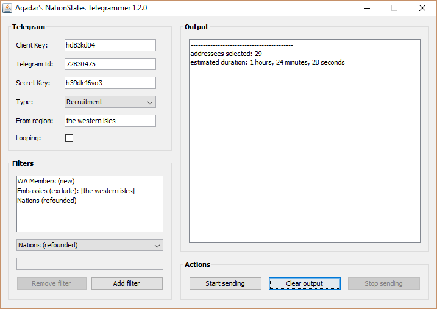

# Agadar's NationStates Telegrammer

This program allows you to automate sending telegrams to other nations, making it useful for recruiting, World Assembly campaigning, region-wide telegramming, and so forth.

Before you use this program, make sure you're familiar with the [Telegrams API](https://www.nationstates.net/pages/api.html#telegrams). You should know how to obtain a Client Key,
and how to create a telegram template. Once you've obtained a Client Key and your telegram template's Telegram Id and Secret Key, you're ready to start using this program.

It uses my own [NationStates API Java Wrapper](https://github.com/Agadar/NationStates-api-java-wrapper) to communicate with the NationStates API.

## Screenshot

## Links

[NationStates forum thread](https://forum.nationstates.net/viewtopic.php?f=15&t=388960)
